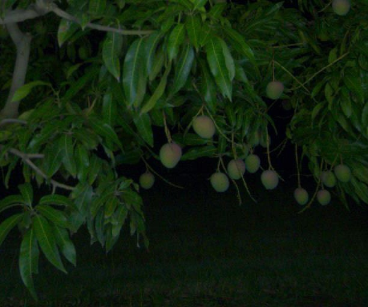
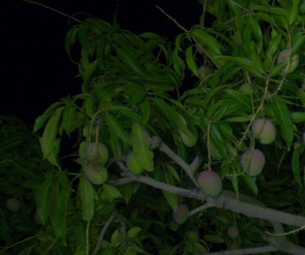
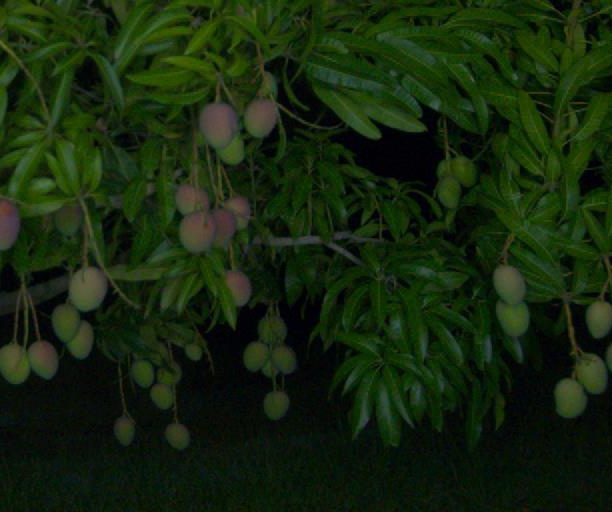
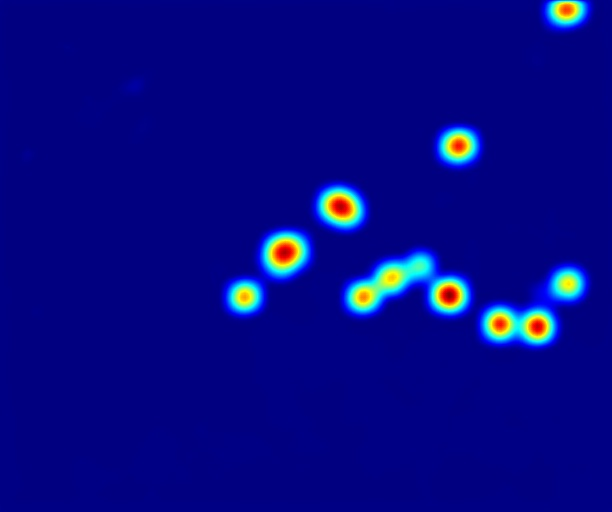
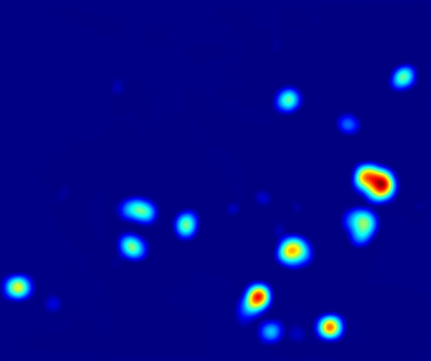
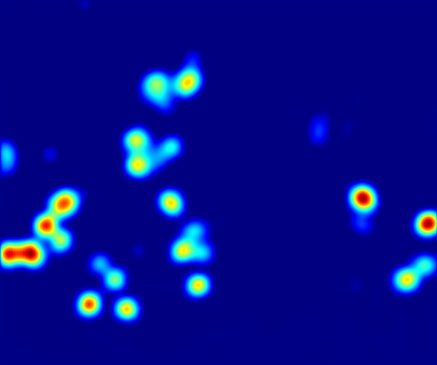
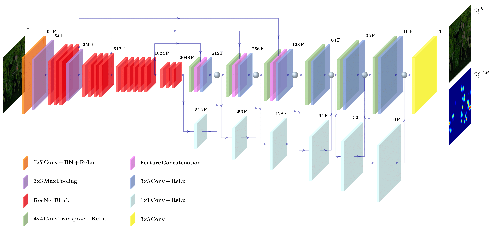

# MangoDetNet

## Original code implementation in PyTorch from the paper: [MangoDetNet: a novel label-efficient weakly supervised fruit detection framework](https://doi.org/10.1007/s11119-024-10187-0)

<div style="text-align:center; width:100%; height:100%">
  
  
  
</div>
<div style="text-align:center; width:100%; height:100%">
  
  
  
</div>


- [Description](#description)
- [Requirements](#requirements)
- [Usage](#usage)
  - [Training](#training)
  - [Validation](#prediction)
  - [Inference](#inference)
- [Dataset](#data)

### Description


<div style="text-align:center; width:100%; height:100%">
  
</div>

The encoder network is characterized by the ResNet50 structure, while the decoder path is specifically designed for both image reconstruction and activation map generation. 
MangoDetNet is trainable using a two-stage curriculum learning approach, following an image reconstruction task during the first stage, and an image classification task during the second stage.

### Requirements

1. [Install CUDA](https://developer.nvidia.com/cuda-downloads)

2. Install dependencies

```bash
pip install -r requirements.txt
```
**Note : Use Python 3.10 or newer**

### Usage
Set parameters on configs.yaml file

- data_roth: ../path/to/Dataset/
- log_path: ../path/to/ProjectRepository/runs/

#### Training 

Run script "apps/train.py" to train the model. 

- exp_name: create a new folder where checkpoint and results are saved
- strategy: switch between reconstruction and binary classification task.

The first stage of training should be performed as an image reconstruction task. During the second stage of training, i.e., the binary classification task, weights can be loaded from the first stage of training checkpoint by setting:

-start_epoch: epoch at which training starts

different from 0. When a training is resumed, set the epoch number to the required training checkpoint and

- resume: True

In this case, also the optimizer checkpoint will be loaded, keeping the previous learning rate scheduler.

#### Validation

Run script "apps/validation.py" to find parameter $r$ and $th_P$ that provide the best RMSE. Set range for grid search in config.yaml using:

- min_r: 
- max_r:
- step_r:
- min_thp:
- max_thp:
- step_thp: 

In config.yaml file, if

- validate_on_boxes: True

the validation will be performed by looking for the best F1 score, thus considering bounding box labels.
Bounding boxes should be provided in YOLO format, including class ID in the first column. 

#### Inference

Run script "apps/inference.py". Set parameters $r$ amd $thp$ fund during validation for local maxima detection. Inference can also be performed considering bounding boxes. 

### Dataset

Datasets should be in PascalVOC format, avoiding the 'Main' folder. 

    ├── Dataset Directory/
    │   └── Devkit/
    │       ├── NumericAnnotations/
    │       │   ├── validation.csv/
    │       │   └── test.csv/
    │       ├── BinaryAnnotations/
    │       │   ├── validation.csv/
    │       │   └── test.csv/
    │       ├── ImageSets/
    │       │   ├── train.txt/
    │       │   ├── train.txt/
    │       │   └── test.txt/
    │       └── JPEGImages/

 while .csv files should be in the following format:
```
names,labels
sample_1_name,label
sample_2_name,label
sample_3_name,label
|
|
|
sample_n_name,label
```

with 'label' meaning the binary label (0 or 1) or the numeric label, i.e., the number of instances present in the related sample.
Multi-Class applicability is not yet implemented. 

## Citing our work

If you find this code useful in your research, please consider citing us:

```
@article{denarda2024mangodetnet,
  title={MangoDetNet: a novel label-efficient weakly supervised fruit detection framework},
  author={Denarda, Alessandro Rocco and Crocetti, Francesco and Costante, Gabriele and Valigi, Paolo and Fravolini, Mario Luca},
  journal={Precision Agriculture},
  pages={1--22},
  year={2024},
  publisher={Springer}
}
```
"# MangoDetNet" 
"# MangoDetNet" 
"# MangoDetNet" 
"# MangoDetNet" 
